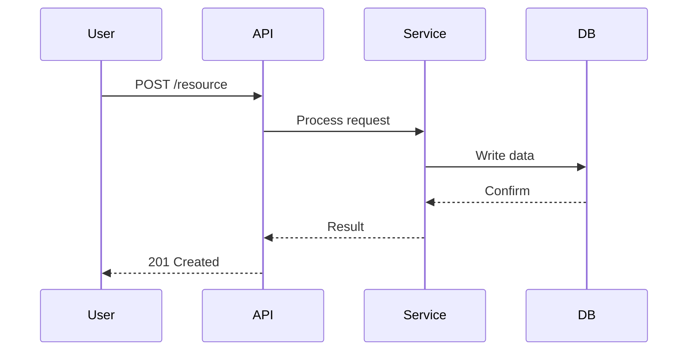

# Tech Proposal Global Template

## Overview

To draft a tech proposal, use the shared global template. Fill in each section with enough detail for reviewers to understand the design, assess risks, and provide feedback. Sections marked "(if applicable)" can be omitted when they do not apply.

------------------------------------------------------------------------

## Metadata

-   **Product Requirements Doc** - Link to the PRD or feature spec driving this work
-   **Strategic Priority** - Which business objective or OKR this supports
-   **Release Timing Constraints** - Hard deadlines, dependency windows, or launch dates
-   **Tech Proposal Date** - When this document was created or last updated
-   **Initiative or Epic** - Jira epic or initiative key (e.g., PROJ-1234)
-   **Document Status**: DRAFT / NEEDS REVIEW / APPROVED
-   **Document Owner**: @mention owner (likely yourself)
-   **Tech Proposal Recording** - Link to recorded walkthrough (if available)

------------------------------------------------------------------------

## Architecture Considerations

Describe the high-level architectural approach and constraints that shape the design.

-   What architectural patterns are being used (e.g., event-driven, request-response, CQRS)?
-   What are the key constraints (performance, compatibility, regulatory)?
-   How does this fit into the existing system architecture?

### Expected Flow

Describe the end-to-end flow for the primary use case. Include a sequence diagram or flowchart where helpful.

**Example format:**

```
1. User submits request via [endpoint/UI]
2. Service A validates input and publishes event to [queue/topic]
3. Service B consumes event, processes data, writes to [database]
4. Response returned to user via [mechanism]
```

For complex flows, include a Mermaid diagram:



------------------------------------------------------------------------

## API Changes

### New Endpoint(s) to Create

-   Provide OpenAPI specs for each new endpoint
-   Run Spectral linter to validate spec quality
-   Document request/response examples with realistic data
-   Specify authentication and authorization requirements

### Existing Endpoint(s) to Edit

-   Provide OpenAPI specs showing the before and after
-   Run Spectral linter to validate spec quality
-   Identify breaking vs. non-breaking changes
-   Describe migration or versioning strategy for breaking changes

------------------------------------------------------------------------

## Data Models

Outline expected data model architecture for inputs and outputs.

-   Define entity relationships (include an ER diagram for complex models)
-   Specify field types, constraints, and validation rules
-   Identify indexes needed for query patterns
-   Document any denormalization or caching strategies

**Example format:**

```
Entity: Order
- id: UUID (PK)
- user_id: UUID (FK -> users.id, indexed)
- status: ENUM(pending, confirmed, shipped, delivered)
- total_amount: DECIMAL(10,2)
- created_at: TIMESTAMP (indexed)
```

------------------------------------------------------------------------

## Domain Architecture

Identify where the system lives in domain maps.

-   Which bounded context(s) does this belong to?
-   What upstream/downstream dependencies exist?
-   Are there cross-domain data flows or shared models?
-   Document any new service-to-service communication

------------------------------------------------------------------------

## Additional Considerations

-   **Related Actors and Objects** - Who or what interacts with this system (users, services, cron jobs)?
-   **Permissions** - What RBAC or authorization model applies? Any new roles or scopes needed?
-   **Unknowns** - What open questions need answers before or during implementation?
-   **Risks** - What could go wrong? Include likelihood, impact, and mitigation for each risk
-   **Feature Flags** - Will this be behind a feature flag? Describe the rollout strategy
-   **Backwards Compatibility** - How will existing clients/consumers be affected?

------------------------------------------------------------------------

## Estimation & Implementation Plan

-   **Estimated engineering effort** - Break down by phase or component (e.g., "API: 3 days, DB migration: 1 day, Frontend: 2 days")
-   **Teams involved** - Which teams need to contribute or review?
-   **Rollout / Deployment Strategy** - Phased rollout, canary, blue-green, or big-bang? Describe each phase
-   **Datadog metrics, alerts, logs** - What dashboards, monitors, and log queries will be added?
-   **Impact analysis (Atlan #data-watch)** - What downstream data consumers are affected?
-   **Rollback plan** - How to safely revert if issues arise in production
